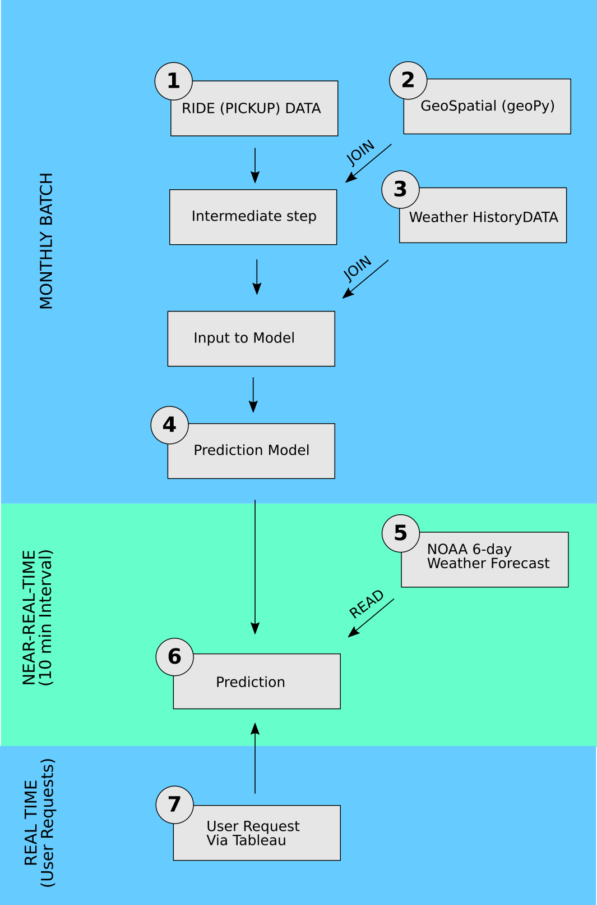
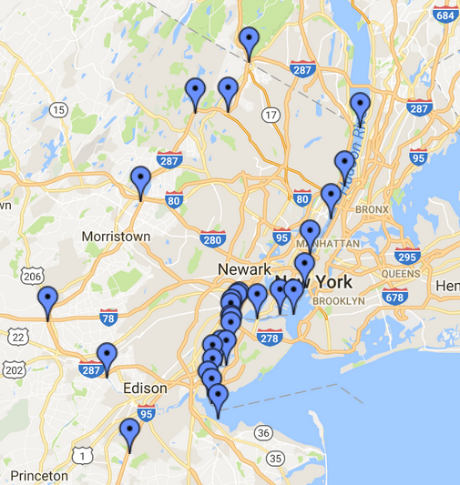

# W205Project

UCB W205 Group Project by John Blakkan, Rohit Nair, Andrea Pope

# Purpose and use-cases

Our goal is to model demand for taxi and ride service vehicles in New York City.   We are not concerned with actual cab dispatch, but want to predict overall borough demand (on an hourly basis) so that cab companies and ride hailing services can pre-position cabs (and cab service staff) at appropriate depots.

We forecast cab (and ride-service) demand as a function of zip code, ride type (yellow/green), month, day-of-month, day-of-week, temperature, precipitation, wind speed and features that are combination of these.

# Architecture

There are seven main pieces.  Refer to figure 2.

## 1 - Ride data Extract-Transform-Load

The ride data ETL retrieves monthly ride data .csv files from amazon s3 and copies them into hive tables.  For development use, there are options in the process to pull over only a subset of the data. There are three sets of monthly .csv files, for yellow cab, green cab, and FHV ("For Hire Vehicles") which are nominally summoned by phone, not hailed on the street.

CSV files are initially loaded to HDFS using TransferTaxi.py script.  During early development, we had separate scripts for loading each of the three types (yellow, green, and FHV) of cabs.  This allowed closer monitoring and gathering of statistics directly during each file load. Later, as the load process stabilized, we adopted a single-python-script approach, providing efficiency both in code and time.  The image below details the raw historical data file formats:

With the .csv data files in HDFS, external schema tables are created in hive, using the CreateExternalData.sql. This follows the formatting provided by the NYC Taxi Commission. Fundamental fields are:   Date/Time of pickup, Lat/Long location of pickup, and number of passengers.   For our purposes, fare information, taxes, etc. are not retained. An additional table is included which stores a location/borough map for the FHV records. Note, not all the FHV records had a location associated with them.  We discard these records.  

With the "external" hive tables complete, the transformation begins. The records are aggregated into a single table for yellow and green cabs with pyspark using the script load_rides_yg.py.  We aggregate to ride source, latitude/longitude, pickup hour/day/month/year, and passenger count. We sum the total rides for against each distinct key.  We also split the record selection (select statement) and insert into the master table. This was for performance reasons.  Prior to the pyspark version, we performed these transformations in hive via sql script "transforming.sql". However, for a full data set, this is not recommended for performance reasons.  In the following steps, longitude/latitude will be used to identify the zipcode for each ride.  

The FHV data is handled slightly differently from yellow and green, as it is provided in a different .csv format. It is added directly to the previously generated for yellow and green, forming the rides_weather final summary table. For FHV, we are grouping by pickup hour/day/month/year, but have a location at a borough level. This is provided via a location/borough map as provided by the NYC Taxi and Limousine Commission. It is important to note again that not all records have a location id. These were not included, as we could not attribute the ride to a specific borough.  [Note:  FHV vehicles are not licensed to pick up rides which are hailed on the street, but sometimes do.  This could explain some of the omissions of geographical pickup information in the FHV data.  The exclusions might be a source of bias in our results, but likely small.  This could be a subject of additional study.]

Yellow/Green data with zip codes added, and FHV data is added in using the SQL file, Transform-Rides-2.sql. (This occurs after step 2.)

## 2 - Local Region Identification transformation of Ride data

Our customer use case is to plan allocation of taxi/ride-service vehicles to smaller regions of NYC, such as zip-codes or boroughs, so the lat/long co-ordinates in the Ride Data must be converted.  

We initially did this with resolution to the borough level in pyspark, with script hive_borough.py.  hive_borough.py, in turn runs borough_finder.py on each row of the ride data.  Borough_finder.py (including its table of borough-bounding-polygons) is distributed by pyspark to all potential parallel processes (much like broadcast variables). See the test script longlat_convert.py for example use (including counts using pyspark accumulator variables).  In effect, this script is performing a hash join not directly with data, but with the output of a function on the data (i.e. lat/long to borough name conversion).

The lat/long to borough function uses borough-bounding polygons created by using the online mapping SAAS at https://www.itouchmap.com/latlong.html.  Boroughs can be bounded with approximately 20 vertices, with water borders requiring fewer points, and complex street boundaries - such as between Brooklyn and Queens - requiring more. The points are defined by the project, not by the website, so there are not IP or Terms-of-Use issues.  The New York City government website was used as a reference for the borough borders (http://maps.nyc.gov/doitt/nycitymap/).  

Here is a sample of one of the bounding polygons, for the "pseudo-borough" of Eastern New Jersey.   While obviously not part of New York City, our analysis showed significant NYC taxi/ride pickups here, so we include it. See also the comment in the section "Look at the raw data", below.

These polygon vertices can be used with matplotlib's point-in-polygon library to provide a transform function for pyspark's map-lambda to add borough identifiers to the Ride data.

Later in the project we determined our preferred method, however.  We currently use the geoPy module for reverse geocoding.  We were initially concerned that, because this module delegates reverse geocoding to a variety of online services, that it would be too slow for our volume of data.   However, the module's internal caching of co-ordinates ultimately proved to have acceptable performance.

The data flow for steps 1 - 3 (historical ride and weather ETL and joining) are illustrated in Figure 4.

The data approach is not normalized, and in fact, we are repeating data across some tables. As the primary (and only) use of this historical data set is for reading (no updating, deleting, etc), this approach speeds our tasks throughout, at the cost of some extra disk space.

## 3 - Historical Weather ETL and join to the Ride Data

Weather data is joined to the ride data in hive, giving historical ride data with weather. Historical weather measurements are those from the NY Central Park weather station. We obtained this data from NOAA at ftp://ftp.ncdc.noaa.gov/pub/data/gsod/2016/. Since we use this only for model building (a batch process), we only need to pull it when the model is updated (e.g. not when current weather forecast is updated). This data can be pulled in from the NOAA ftp server.
The data (received in .csv form) are lightly transformed (in excel or equivalent, although this could be scripted). Fields used are: Date, Total Precipitation (in tenths of mm), Daily Mean temp (F), and Wind speed. The script downloadWeatherDataGSOD.sh downloads the weather data from the ftp server, parses and transforms the data and uploads it into HDFS. "create_ny_weather_schema.sql" script is ran to create the "ny_weather" table.

We implement a hash-join to join weather information to the ride data with pyspark code because the daily weather data is very small compared to the ride pickup table (i.e. there are many taxi pickups per day, but we only have one overall weather report - with 24hr max/min temperature and precipitation - per day. We extract this data into csv format for model training.
Pyspark map/lambda is used to perform this hash-join.

As a side note, this was also completed initially using .sql, as represented in the Transform-Rides-2.py file. Using consolidated ride data (at zip/hour level), the amount of joining was reduced. 

## 4 - Prediction model

Based on historical demand for cab services, we developed a prediction model to forecast demand for a cab service at a zip code/borough for a given or day. A Stochastic Gradient Descent(SGD) Regression model was trained on two years’ worth of data which was split into training and validation set. Two independent models were trained for yellow and green cabs separately as they differ in demand and hence ensemble model approach provide better accuracy. The features used were ride type, zip code, month, day-of-month, month-of-year, mean temperature, precipitation, wind speed and a combination of these features. Combination of features were used as we rightly assumed that there will be variation in demand, such as, high demand on weekdays in financial district while higher demand for cabs during weekends from tourist attractions. Further we took into account effect of rainfall or snow in taxi demand. To address the variation in temperature, it was split into 'Cold', 'Normal', 'Hot'. This along with zip code and ride type were treated as categorical features. To deal with these features, a Dictionary Vectorizer was used which split them into one-vs-all features. These vectorized features were fed into the regression model and trained for 8,000 iterations and the loss was plotted against number of iteration. The loss function plateaued faster for Green cab compared to Yellow. When ran against the cross-validation set, the model for Green cab performed better (R2: 0.92) compared to Yellow (R2: 0.89). The trained model is persisted as a pickle file which can be conveniently loaded to run predictions.

## 5 - Current weather forecast for NYC

This is pulled every 10 min from NOAA's XML service (http://graphical.weather.gov/xml/sample_products/browser_interface/ndfdBrowserClientByDay.phpusing). The script forecast_server.py parses the XML and creates a postgres table of 6-day weather_predictions.  forecast_server.py can be run from the command line, but for production will be run via start_forecast.py.   This script cleans the data by translating the mixed 12hr/24hr results into uniform 24 hr. results, and transforming pairs of 12 hr precipitation probabilities into single 24hr probabilities (i.e. the 24 hr. probability is the max of the day and night probabilities).  Timestamps of the NOAA downloads are also kept, so that "stale" weather data can be identified.  We pull, cache, and transform the data in this manner because we have observed that the site has a high variance in response time (up to 10s of seconds). It also becomes unavailable for minutes at a time.  This is only a 6 line table so we use postgres.  Attention is paid to using transactions when modifying this table, as prediction software might read it asynchronously, and we need to prevent prediction attempts from a partially updated table (i.e. three lines from an older forecast and 3 lines from a newer.)

## 6 - Prediction

The script zip_ride_prediction.py contains the logic to generate forecast for the next 6 days using the weather forecast from "weather_forecast" table and geo-coding from "zipcode_neighborhood_borough". The script retrieves the input data for the prediction by cross joining weather forecast with the zipcode-borough mapping. The model and vectorizer is picked from the persisted pickle file and ran against the input. This produces an integer value that represents the number of forecasted cab per zipcode per day. We use this daily forecast data along with hourly demand curve per zipcode to get hourly forecasted demand for taxis. The daily and hourly forecasted data is stored in the postgres tables as  "zip_ride_prediction" and "hourly_zip_ride_prediction" along with the model run timestamp. "zip_ride_prediction.py" can be run from the command line, but for production will be run via crontab (at 5, 15, 25, 35, 45, and 55 min after the hour).

## 7 - Tableau presentation
Tableau allows for analysis and discovery with the historical data file, and provides an interface to review predictions for future ride needs, incorporating the results from the prediction model run against the most recent weather forecast.

There are 4 primary data sources:

From HIVE:
 - Historical data at hour/zip code/passenger count level (yellow and green cabs only...not available for FHV). This data was included to add additional detail (beyond borough and neighborhood). It is important to note, that in NYC, there are over 100 distinct zip codes. Each borough neighborhood has several zip codes.
 - Historical data at hour/borough/passenger count (yellow, green and fhv). This data is mapped to historical weather data, including the max, min temp, and total precipitation on the day of the ride.

From POSTGRES:
 - Ride Prediction - predicts rides (yellow or green) for each hour for the next 6 days (following 6-day weather forecast)
  - Weather Forecast - simple table with the 6-day weather forecast

###Historical Data Dashboard:

###Prediction Dashboard:

For this project, the Tableau workbook is zipped together with extracts (TDE) files of the datasources at the time of last running. However, the structure is in place to connect directly to running instances of HIVE and POSTGRES. The specific instance identification would need to be updated, but it will read the correct tables and do any additional calculations automatically.

There are 12 views included in the workbook, and 10 of them are included in 3 dashboards. The other 2 are for reference purposes. The dashboards can also be found on Tableau Public (with snapshot data) at:
Historical Dashboard:
https://public.tableau.com/profile/publish/NYCTaxi-Analysis/NYCTaxiLimoDash#!/publish-confirm
Predicting Dashboard:
https://public.tableau.com/profile/publish/NYCTaxi-Analysis/Predicting#!/publish-confirm
Prediction Details (Data Table):
https://public.tableau.com/profile/publish/NYCTaxi-Analysis/PredictionDetailswFilters#!/publish-confirm

Tableau Public does not allow connections to HIVE or Postgres. In this case, it is using Tableau extract files. In a real-world situation, the views and dashboard may be best served via Tableau Server. It would depend on the number of consumers of the reports. If it was a single user, a single production license connecting to the environment may be sufficient. For multiple users, Tableau Server may be beneficial.

# Dependencies and operation

The standard EC2 AMI is used, running on an M3 Large instance.

## Python modules

* matplotlib - used for the "point-in-polygon" determination of boroughs from lat/long co-ordinates
* psycopg2 - postgresql access
* urllib - fetching the real-time weather forecasts from the NOAA XML server
* geopy - reverse geocoding (in some versions of the application, and for research/analysis)
* lxml - XML parsing of the NOAA real-time weather forecast.
* scikit-learn - machine learning package

Also used are standard modules, including sys, random, numpy, time, datetime, and threading (used for the weather forecast periodic fetch)

## One time setup processes

Determine bounding polygons in lat/long co-ordinate system for the five boroughs of New York City (plus a region of Eastern New Jersey) was a one-time only setup. Ultimately, we used a different method to perform reverse geomapping - the geoPy module, but we note this here as a one-time step, should it ever be necessary to revert to the bounding polygon method.

## Monthly Batch process

The ETL flow is:

1. Load monthly ride data from source .csv files on Amazon S3.   We're currently using July 1, 2014 to June 30, 2016 as our model training period.  (If users choose to retain the raw .csv files, each month only one additional month's data will need to be fetched).
2. Strip header lines from ride .csv files
3. Copy into single hive table with consolidated, uniform format for all ride services
4. Load historical weather from source  nyGSODWeather.csv files
5. Strip header lines from weather .csv file
6. Use borough_finder pyspark porgram to  to convert lat/long information into borough names in hive table rides_yg_with_boroug
7. Hive join of weather onto ride data, based on date, creating table: rides_weather

## Periodic results pre-calculation

To speed user access, we pre-cache (every 10 minutes) the results of a 6-day weather forecast from NOAA, parsing it and copying it into postgres table weather_prediction.    This is done from start_forecast.py.   (This is a threaded script, run in background.  An alternative is to run it as a cron job, but this wrapper script was found to have simpler administration for development use).    Note that this is done both for performance and reliability, as the NOAA site, in our experience, is occaisionally unavailable for several minutes at a time.   With the local copy, results are always available, even if slightly out of date.  Timestamps are available for the user to be aware if they are seeing "stale" weather forecasts.  In practice, we've never seen a forecast go stale for longer than a single 10 minute interval.

In addition to the periodic update of the weather forecast, the ride-utilization model is run every 10 min, providing pre-computed results and eliminating user wait time.

## Serving results

Results are presented via Tableau from the pre-calculation

# Analysis, Observations, and Ideas for further development

## Notes on Data

We believed our dataset covered New York City originating taxi rides.  However, mid-way though the project, we discovered there were many rides originating outside New York.   In particular, New Jersey had more "New York City" rides that did the borough of Staten Island.   This caused us to adjust the project to also cover an Eastern portion of New Jersey, treating it (for purposes of analysis) as a "pseudo-borough" of New York city.

We also found other outliers, including rides originating in Las Vegas.   These may include use of ride hailing services where the ride was actually booked while in Las Vegas, but we did not pursue further analysis of these, choosing simply to exclude them.  

## Notes on Data Transformation

We followed two parallel paths in determining how to translate the ride pickup location (in decimal lat/long co-ordinates) into local region.  Our first method involved using public mapping sites to produce bounding polygons for the boroughs.  This involved a one-time effort, and required no web access during later processing.  Library algorithms to do "point-in-polygon" determination were used.  We also added a speed enhancement to this:   Each datapoint was roughly categorized as "Western," "Northern," or "Southern," and this initial categorization was used to determine the order in which the detailed polygon match was attempted.   (For example, if a point was Northern, the Bronx and Manhattan polygons would be checked first.  If a point was Western, NJ and Staten Island would be checked first.)  See function find_borough in script borough_finder.py for details.

Our second method was to use available python modules (including geoPy) which could do reverse lookup.   This was a two stage process:  First lat/long to zip code, then a translation of zip-code to borough and neighborhood.  The modules looked up data from public websites, but also did caching of geospatial information to maintain performance.   

The first point-in-polygon was satisfactory with respect to performance, but we are currently using the geoPy/Zipcode method.

# Future work and Extensions

## Scale

If we were developing a nation-wide system, pre-calculating all the results could be problematic.   Our scope was only New York City plus portions of New Jersey.  In the case of a later nation-wide expansion, we would likely include a different strategy - either distributing a full pre-calculation over many nodes, or perhaps by caching results for only the largest metro areas, with rural areas calculating only "on-demand" (with a correspondingly lower service-level-agreement on response time).

## Resolution of weather to small regions

We regarded weather as uniform in our geographical region.   The New York metro area is on the east coast of a continent, and generally has the a uniform weather pattern.   This is on contrast to other areas, such as the San Francisco Bay Area, where there are significant regional microclimates.   Expansion of the system to other metro areas might need to account for regional microclimates.

It is also possible that for a nationwide system, processing of the periodic weather reports for a thousand or more weather stations would be a candidate for spark streaming or Apache Storm.

# Observations and notes on the development process

## Data Checkpointing is important

When working with large datasets - i.e. billions of raw records - we had several instances of multi-hour Data ETL processes fail, resulting in up to half-day development delays.   This happened for several reasons:  Once when users - not realizing the task was underway, shut down the EC2 instance.  Other times when spark jobs were running with the same application name (which, if not unique in the system, will cause jobs to silently lock up).

## "Mock" databases (or subsets of larger database) are important

Even the monthly partitions of the databases are large enough that some steps will require many minutes of processing during the development phase.  It was useful to be able to reduce the size of the input .csv files to greatly reduce the time taken by development test runs.   To facilitate this, we produced a small script called "decimate.py."   It takes an argument indicating what proportion of the .csv lines in a file to retain (we often used 0.001, for 0.1%).  Because we didn't want our sampling to possibly correlate with any data sequence feature, decimate.py sieves out lines of a .csv stochastically, rather than by stepping through the file with an interval.  If decimate.py is instead given an integer argument greater than 1 (i.e. 2000), it operates differently- it simply pulls over the number of characters specified by the integer argument, trims off any incomplete lines, and uses the remainder to make a super-tiny, non-representative .csv file for process testing.   (i.e. specifying 2000 characters yields around 12 lines of .csv)

## Rapid prototyping and unit testing are important.

The near-real time element of the project is the fetching of NOAA forecast data for the prediction model.  Early in the project, we mocked up a simple Ruby-on-Rails website to drive our "poll of NOAA and parse" functions.  Because this tool made it easy to repeatedly test the NOAA interface, we were able to extensively test it.  We found multiple problems.  The first problem was that NOAA actually provides only 6.5 of forecast data for some weather parameters, not 7 days.  We stopped applications from erroring-out by using only the actual valid data (we picked 6 days).  See the figure below, note the missing value for predicted min. temperature on day 7.

  

The second major problem is that the NOAA interface has a highly variable response time - sometimes over 15 seconds.   The NOAA site overall appears to go down for minutes at a time, particularly in the early hours of the morning (Eastern Time).  [It is also possible that the NOAA website was recognizing too-frequent requests and throttling us.]   Based on this, we realized we needed to cache a local copy of the forecast, and periodically refresh it.  Had we not learned this early in the project, we would have developed a system which appeared to work in testing, but under higher load would have frequently failed.

## Building the "Steel Thread" end-to-end preliminary version is a good idea.   We didn't do it (enough).

The assignment recommends getting a stripped-down version of the full system ("A Steel Thread") working early on, then adding to it. We originally decided to work with 1 year of data, as a subset to test our processes. But this was still too large. We should have picked something much more “thread-like”, for example 0.1% of the records. We did our integration relatively late, after building ETL and Serving systems. We did benefit from having mock databases to keep all elements being developed towards the same schema.   But we did have an integration phase at the end of the project which was lengthier than it might have been if we'd integrated earlier.

## Parallel development of competing implementations is good (if resources are available)

One of the fundamental features of our project was the need for reverse geocoding.  Our ride pickup data was all in lat/long co-ordinates.  We needed to translate this into borough names.  We _preferred_ to translate it down to zip-code resolution (i.e. neighborhoods).  We proceeded on two parallel tracks:   One effort used a set of bounding polygons around each borough, then used in-memory calculation of point-in-polygon (using pyspark, and shared user defined functions shared between all worker instances - see borough_finder.py and hive_borough_demo.py).  It was fast - 120 million conversions and writes to table in 48 min {with perhaps a third of that time in extraneous debugging output}) - but our preferred solution was to use the geoPy module to convert to zip-code resolution.  geoPy caches locations, so ultimately was the solution we used was geoPy.

## Look at the raw data, there may be surprises.

A minor issue we found was the presence of a small number of "out-of-new-york-city" pickup locations.   Some were in Las Vegas, others were scattered around the country.  We think this may be from user error in some application (i.e. having the location where the trip was booked, rather than the actual pickup location).

The more profound thing we found:  The number of pickups in all of Staten Island appears to be smaller than the number of pickups that originate in New Jersey.   This finding led us to re-consider the scope of the project; we decided to include a portion of New Jersey as within our project's geographical scope.

Other interesting items in the data (when perusing with HUE and Tableau):   Ridership is greater in the fall than the spring; and passenger loads per cap seem higher during particularly warm or particularly cold weather.

## "Skew" of data size needs to be considered; in-memory hash-joins may be better than general database joins

An hourly prediction of a year's worth of activity is only 8760 elements.   Rather than doing a database join operation, pyspark (with broadcast variables of hashes, or hashes included in the shared functions) may be a better choice.   This was implemented in the hive_borough.py script.
