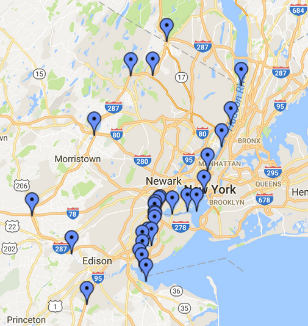

# W205Project

UCB W205 Group Project by John Blakkan, Rohit Nair, Andrea Pope

# Purpose and use-cases

Our goal is to model demand for taxi and ride service vehicles in New York City.   We are not concerned with actual cab dispatch, but want to predict overall bourough demand (on an hourly basis) so that cab companies and ride hailing services can pre-postition cabs (and cab service staff) at appropriot depots.

We model cab demand as a function of week-of-year, day-of-week, hour-of-day, and weather factors.

# Architecture

There are seven main pieces:

## 1 - Ride data ETL

This is consolidated for several taxi/ride-hailing services (in hive).  Fundamental fields are:   Date/Time of pickup, Lat/Long location of pickup,
and number of passengers (for our purposes, fare information, taxes, etc. are not retained)

## 2 - Historical Weather ETL and join to the Ride Data

This is joined to the ride data, giving historical ride data with weather (in hive, as measured at NY LaGuardia Airport).  We get this data from NOAA at https://www.ncdc.noaa.gov/cdo-web/. Since we use this only for model building (a batch process), we only need
to pull it when the model is updated (e.g. not when current weather is updated).    NOAA requires this data be accessed
by a request for data return by email.

The data (ingested in .csv form) is lightly transformed (in excel or equivalent, although this could be scripted.)   Snowfall is accounted as rainfall in a 10:1
ratio (i.e. 10mm of snow = 1mm of rain).   Fields used are: Date, Total Precipitation (in tenths of mm), Daily Max temp (F), and Daily Min temp (F)

We implement a hash-join to join weather information to the ride data with pyspark code because the daily weather data is very
small compared to the ride pickup table (i.e. there are many taxi pickups per day, but we only have one overall weather report (with 24-hr max/min temp and precipition) per day.  In-day variances are co-linear with hour-of-day, so will have input to our model.

Pyspark map/lambda is used to perform this hash-join.

## 3 - Borough Identification transformation of Ride data

Our customer use case is to plan allocation of taxi/ride-service vehicles to Boroughs, so the lat/long co-ordinates in the Ride Data must be converted to borough.  This is done in pyspark, with a program called hive_borough.py.  In turn, it runs borough_finder.py on each row of the Ride data.  Borough_finder.py (including its table of borough-bounding-polygons) is distributed by pyspark to all potential parallel processes (much like broadcast variables).   See the test script for example use (inculding counts using pyspark accumulator variables).

We obtain this data by using the online SAAS at https://www.itouchmap.com/latlong.html to create bounding polygons for each borough.  Boroughs can be bounded with approximately 20 vertices (with water borders requiring fewer points, and complex street boundaries - such as between Brooklyn and Queens requiring more).  Note:  The points are defined by the project, not by the website, so there are not IP or Terms-of-Use issues.  The New York City government website was used as a reference for the borough borders (http://maps.nyc.gov/doitt/nycitymap/).  

Here is a sample of one of the bounding polygons, for the "pseudo-borough" of Eastern New Jersey.   (Which is obviously not part of New York City, but our analysis showed significant NYC taxi/ride pickups here, so we include it.

These immutable polygon vertices are used with matplotlib's point-in-polygon library to provide a transform function for pyspark's map-lambda to add borough identifiers to the Ride data.

## 4 - Predictive model, with parameters

This is produced from the ride/weather data, and placed in a (TBD) table (in postgres).

## 5 - Current weather forecast for NYC

This will be pulled every 10 min from NOAA's XML service (http://graphical.weather.gov/xml/sample_products/browser_interface/ndfdBrowserClientByDay.phpusing). Script pf2.py parses the XML and creates a postgres table 6-day weather_prediction.  pf2.py can be run from the command line, but for production will be run via crontab (at 0, 10, 20, 30, 40, 50 min after the hour).  This script cleans the data by translating the mixed 12hr/24hr results into uniform 24 hr. results, and transforming pairs of 12 hr precipitation probabilities into single 24hr probabilities (i.e. the 24 hr. probability is the max of the day and night probabilities).  Timestamps of the XML downloads are also kept, so that "stale" weather data can be identified.  We pull and cache (and transform) the data in this manner because we have observed that the site has a high variance in response time (up to 10s of seconds) and also becomes unavailable for minutes at a time.  This is only a 6 line table ("weather_prediction") so we use postgres.  Attention is paid to using transactions when modifying this table, and per-line timestamps are retained.

## 6 - Prediction

Then script ride_prediction.py takes the forecast from postgres table "weather_prediction" and the model parameters from postgres (TBD) table, and produces postgres table ride_prediction.   ride_prediction.py can be run from the command line, but for production will be run via crontab (at 5, 15, 25, 35, 45, and 55 min after the hour).  The output of this table is: For each of 5 boroughs, for each of 6 days, for each hour in each day, a predicted number of large taxis (4 or more passengers) and small vehicles (3 or fewer passengers).  The timestamp of the weather_forecast used to generate the prediction is also passed through, so the user can verify the age of the forecast used for the predictions.

 This 720 row table (5 * 6 * 24) is kept in postgres.

## 7 - Tableau presentation

Tableau will serve data from the ride_prediction table.  The predicted number of pickups  

 * for each borough
 * for each hour
 * of the next 6 days  
 
will be presented (along with appropriate graphs).   Users will also see the UTC timestamp of the last successful fetch of weather forecasts, to be informed in the (unlikely but possible) event that the forecast is out of date.  Our User-story is of a planner deciding how many taxi company vehicles to allocate to each borough, or for a ride hailing service to use to incentivize their drivers to position their private vehicles appropriately.

# Dependencies and operation

The standard EC2 AMI is used, running on an M3 Large instance.

## Python modules

* matplotlib - used for the "point-in-polygon" determination of boroughs from lat/long co-ordinates
* psycopg2 - postgresql access
* urllib - fetching the real-time weather forecasts from the NOAA XML server
* geopy - reverse geocoding (in some versions of the application, and for research/analysis)
* lxml - XML parsing of the NOAA real-time weather forecast.

Also used are standard modules, including sys, random, numpy, time, datetime, and threading (used for the weather forecast periodic fetch)

## One time setup processes

Determine bounding polygons in lat/long co-ordinate system for the five boroughs of New York City (plus a region of Eastern New Jersey.) These will be used by the point-in-polygon algorithem in ZZZZ.py to identify 

## Monthly Batch process

This may be run (as user w205) via script XXXXX-TBA-XXXXX.py.  The ETL flow is:

1) Load monthly ride data from source (???) .csv files.   We're currently using July 1, 2014 to June 30, 2016 as our model training period.  (If users choose to retain the raw .csv files, each month only one additiional month's data will need to be fetched).
2) Strip header lines from ride .csv files
2) Copy into single hive table with consolidated, uniform format for all ride services
3) Load historical weather from source (???) .csv files
4) Strip header lines from weather .csv file
4) Hive join of weather onto ride data, based on date, creating table: XXXXX_XXX_XXX
5) Use borough_finder pyspark porgram to  (spark-submit XXXXX.py) to convert lat/long information in XXXXX_XXX_XXX into borough names in hive table YYYY_YYYY

## Periodic results pre-calculation

To speed user access, we pre-cache (every 10 minutes) the results of a 6-day weather forecast from NOAA, parsing it and copying it into postgres table weather_prediction.    This is done from start_forecast.py.   (This is a threaded script, run in background.  An alternative is to run it as a cron job, but this wrapper script was found to have simpler administration).    Note that this is done both for performance and reliablity, as the NOAA site, in our experience, somemtimes is unavailable for several minutes at a time.   With the local copy, results are always available, even if slightly out of date.    (Timestamps are available for the user to be aware if they are seeing "stale" weather forecasts.  In practice, we've never seen a forecast go stale for longer than a single 10 minute interval)

In addition to the periodic update of the weather forecast, the ride-utilization model is run every 10 min, providing pre-computed results and eliminating user wait time.    The scope of our problem permits us to pre-calculate for all 5 boroughs plus Eastern New Jersey.  

## Serving results

Results are presented via Tableau from the pre-calculation

# Analysis, Observations, and Ideas for further development

## Notes on Data

We believed our dataset covered New York City originating taxi rides.  However, mid-way though the project, we discovered there were many rides originating outside New York.   In particular, New Jersey had more "New York City" rides that did the borough of Staten Island.   This caused us to adjust the project to also cover an Eastern portion of New Jersey, treating it (for purposes of analysis) as a "pseudo-borough" of New York city.

We also found other outliers, including rides originating in Las Vegas.   These may include use of ride hailing services where the ride was actually booked while in Las Vegase, but we did not pursue further analysis of these, choosing simply to exclude them.  

## Notes on Data Transformation

We followed two parallel paths in determining how to translate the ride pickup location (in decimal lat/long co-ordinates) into borough name.   The first was to use available python modules (including geoPy) which could do reverse lookup.   This was a two stage process:  First lat/long to zip code, then a translation of zip-code to borough and neighborhood.  The modules looked up data from public websites, but also did caching of geospatial information to maintain performance.   Our second method involved using public mapping sites to produce bounding polygons for the boroughs.  This involved a one-time effort, and no "during-analysis" web access.  Library algoritms to do "point-in-polygon" determination were used.   However, we added a speed enhancement to this:   Each datapoint was roughly categorized as "Western," "Northern," or "Southern," and and this initial categorization was used to determine the order in which the detailed polygon match was attempted.   (For example, if a point was Northern, the Bronx and Manhattan polygons wouuld be checked first.  If a point was Western, NJ and Staten Island would be checked first). 

The first "geoPy" method had the advantage of giving neighborhood, rather than borough resolution.  (Although the bounding polygon method could have been augmented with smaller neighborhood polygons).   Our current implementation is based on the polygon method, as it gave satisfactory performance, and our use-case only required borough-level geographic resolution.

## Future work, extensions, and challanges

 If we were developing a nation-wide system, pre-calcualating all the results could be problematic.   Our scope was only 5 boroughs plus New Jersey.  In the case of a later nation-wide expansion, we would likely include a different strategy - either distributing a full pre-calculation over many nodes, or perhaps by caching results for only the largest metro areas, with rural areas calculating only "on-demand" (with a correspondingly lower service-level-agreement on response time).
 
 We regarded weather as uniform in our geographical region.   The New York metro area is on the east coast of a continent, and generally has the a uniform weather pattern.   (This is on contrast to other areas, such as the San Francisco Bay, where there are significant microclimates).   Expansion of the system ot other metro areas might need to account for regional microclimates.
